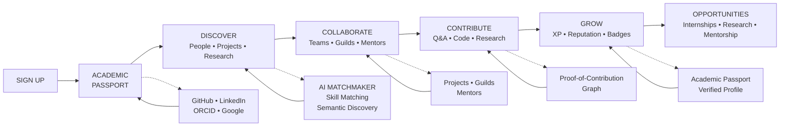
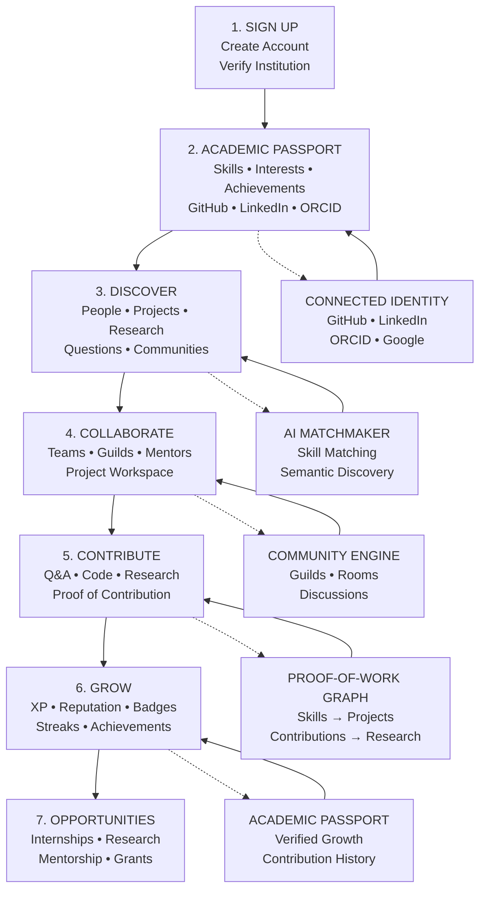
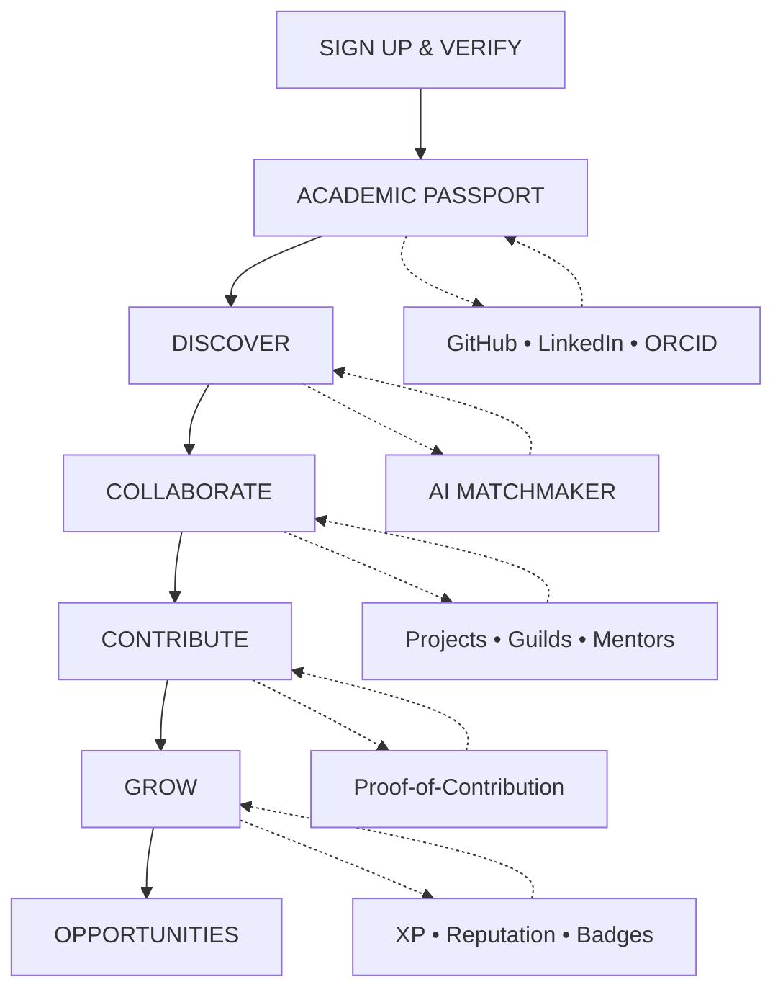
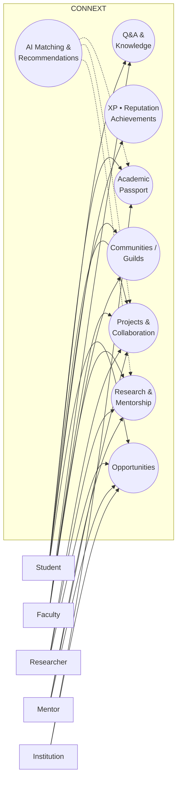

# Connext — Complete Project Chat Record

**Project:** Connext — The Next Network for Learning & Collaboration  
**Context:** RepoForge 2026 project / presentation development

---

## 1. Project Concept

### Mission

Build a **Nationwide Student & Staff Collaboration Portal** combining:

- Social Networking
- Community Building
- EdTech
- Gamification

### Core Problem

There is no unified nationwide platform where students and academic staff can freely ask questions, share projects, collaborate, contribute ideas, seek academic help, find mentors, discover research, and access opportunities.

Students may hesitate to ask questions in class because of fear of judgment.

### Intended Product Mix

- **Quora / Stack Overflow:** Questions, answers, upvotes, reputation
- **Discord:** Communities, rooms and discussions
- **Snapchat / Duolingo:** Streaks and engagement mechanics
- **LinkedIn:** Professional / academic identity
- **GitHub:** Projects and contribution history
- **ResearchGate / ORCID / Google Scholar:** Research identity and proof of work
- **Project collaboration:** Team discovery, project workspaces and milestones
- **Mentorship:** Students, faculty, researchers and industry mentors
- **Research:** Research discovery and faculty expertise
- **Gamification:** XP, levels, ranks, quests, achievements and streaks
- **AI:** Matching, recommendations, semantic search and research assistance

---

# 2. Product Name

## Connext

### Title

**Connext — The Next Network for Learning & Collaboration**

### Tagline / Positioning

> One connected academic identity for asking, building, researching, mentoring and growing — beyond the boundaries of a campus.

### Product Vision

> **Connect People. Build Knowledge. Grow Together.**

### One-Line Pitch

> Connext is the academic collaboration layer connecting people, knowledge, projects, research and opportunities across institutions.

### Product Positioning

Connext is not simply another social network. It is a **contribution and collaboration layer for academic life**.

---

# 3. Product Design Direction

An early UI direction experimented with a Solo Leveling-inspired interface. It was considered too animated, so the preferred direction became a modern SaaS product with subtle System-style mechanics.

### Visual Direction

- Modern SaaS UI
- Professional for students, professors, researchers and recruiters
- Light / neutral surfaces
- Clean typography
- Spacious layouts
- Restrained accent colors
- Familiar SaaS interactions

### Subtle System Mechanics

- System messages
- XP
- Rank
- Quests
- Streaks
- Achievements
- Progress indicators

### Design Principle

> **Modern Product + Academic Trust + Social Community + Gamified Progress + Subtle System Aesthetic**

Avoid excessive neon, anime character art, giant HUDs, constant animation and over-gamification.

---

# 4. Core Product Modules

## Unified Academic Identity

A single profile connecting:

- Education
- Institution
- Skills
- Projects
- Achievements
- GitHub
- LinkedIn
- Stack Overflow
- ResearchGate
- ORCID
- Google Scholar
- Research contributions

## Academic Passport

A portable academic identity representing:

**Education + Skills + Projects + Code + Research + Contributions + Achievements**

The aim is to demonstrate **proof of work** rather than only self-declared skills.

## Q&A

- Ask questions
- Answer questions
- Upvote useful answers
- Tags
- Reputation
- Anonymous academic questions

## Anonymous Academic Questions

Students can initially ask questions anonymously to reduce fear of judgment, and later attach their identity and receive reputation for useful contributions.

## Communities / Guilds

Examples:

- AI Research Guild
- Open Source Guild
- Cybersecurity Guild
- Competitive Programming Guild
- Women in Tech Guild

Guilds are designed to cross institutional boundaries.

## Project Collaboration

Users can create projects, discover projects, find teammates, join teams, contribute and track milestones.

## Faculty Discovery

Discover faculty by research expertise, skills, publications, interests and mentoring areas.

## Research Hub

Research discovery, faculty research profiles, papers, research projects and collaboration.

## Mentorship

Connect students with faculty, researchers and industry mentors.

## Opportunity Hub

Potential opportunities include internships, research projects, mentorship, grants and collaborations.

---

# 5. Stand-Out Features

## 5.1 Academic Passport

> One profile. Every achievement. Verified proof.

Combines education, skills, projects, research, achievements, contributions and external identities.

## 5.2 AI Collaboration Matchmaker

A user can describe a project requirement such as:

> “I need a Flutter developer interested in healthcare AI and available for a 6-week project.”

Matching factors:

- Skills
- Interests
- Experience
- Availability
- Project requirements
- Collaboration history

## 5.3 Proof-of-Contribution Graph

A signature idea connecting:

**Person → Skill → Project → Contribution → Repository → Publication → Achievement**

Example:

> Python → Project X → GitHub PR → Research Dataset → Publication

## 5.4 Contribution Reputation

The platform focuses on meaningful contribution instead of follower counts and popularity.

Contribution signals include:

- Helpful answers
- Project contributions
- Mentoring
- Research
- Community leadership
- Verified achievements

## 5.5 Cross-Campus Guilds

Students and staff from multiple institutions can collaborate in shared communities.

## 5.6 Learn → Contribute → Prove → Grow

The core product loop is:

> **Learn → Contribute → Prove → Grow**

---

# 6. Proposed Solution — Simple PPT Content

## The Problem

Academic collaboration is fragmented across classrooms, WhatsApp/Telegram groups, Discord, LinkedIn, GitHub, and research platforms. Students often hesitate to ask questions, struggle to find the right teammates or mentors, and have no single profile to showcase their real academic contributions.

## How Connext Solves It

Connext brings students, faculty, researchers, and mentors into one platform for Q&A, communities, projects, research, mentorship, and opportunities. Users can create an **Academic Passport** that connects their skills, projects, achievements, and external profiles in one place.

## Innovation & Uniqueness

Connext goes beyond a traditional social network with an **AI Collaboration Matchmaker**, **Proof-of-Contribution Graph**, cross-campus **Guilds**, and contribution-based **XP, streaks, quests, and reputation**—turning scattered academic activity into a connected and verifiable journey.

---

# 7. Solution Format With Three Pillars

## Solution

Connext is a unified academic collaboration platform that connects students, faculty, researchers, and mentors beyond their individual campuses.

## How it Works (3 Pillars)

### Academic Passport

Combines education, skills, projects, achievements, GitHub, research, and other verified profiles into one academic identity.

### Smart Collaboration

AI matches students with relevant teammates, mentors, projects, research, and communities based on skills, interests, and requirements.

### Contribution & Community

Q&A, cross-campus guilds, project collaboration, XP, streaks, quests, and reputation turn learning into measurable contribution.

## Impact

Breaks campus boundaries and makes it easier to ask questions, find collaborators, showcase real work, and access mentorship and opportunities.

## Innovation

A **Proof-of-Contribution Graph** connects:

**Skills → Projects → Contributions → Repositories → Research → Achievements**

creating a profile based on evidence rather than popularity.

---

# 8. Technical Approach

## Technologies to be Used

- **Frontend:** Next.js, React, TypeScript, Tailwind CSS
- **Backend:** Node.js, FastAPI, REST APIs
- **Database:** PostgreSQL + Redis
- **AI:** LLMs, embeddings, Vector Database
- **Integrations:** GitHub, LinkedIn, Google, ORCID, ResearchGate
- **Deployment:** Docker, Cloudflare, GitHub Actions

## Methodology & Process

1. **User Onboarding:** Register → Verify Institution → Create Academic Passport
2. **Profile Integration:** Connect GitHub / LinkedIn / ORCID → Build Skill Graph
3. **Discovery:** AI recommends questions, people, projects, mentors and communities
4. **Collaboration:** Create/join projects → communicate → contribute → track milestones
5. **Contribution Engine:** Verify contributions → award XP, reputation, streaks and achievements
6. **Growth:** Update Academic Passport → discover research, mentorship and career opportunities

## Prototype Flow

```text
User
  ↓
Academic Passport
  ↓
AI Matching
  ↓
Discover
  ↓
Collaborate
  ↓
Verify Contribution
  ↓
XP / Reputation
  ↓
Opportunities
```

## Security & Scalability

- OAuth-based authentication
- Role-based access
- Privacy controls
- API security
- Caching
- Modular cloud deployment

---

# 9. Architecture

## High-Level Architecture

```text
                         CONNEXT USERS
                   Student • Faculty • Researcher
                         • Mentor • Institution
                               │
                         Identity Graph
                               │
          ┌────────────────────┼────────────────────┐
          │                    │                    │
    Knowledge Graph       Project Graph       Research Graph
    Questions/Answers     Teams/Repositories  Papers/Mentors
          │                    │                    │
          └────────────────────┼────────────────────┘
                               │
                         CONNEXT AI LAYER
                 Match • Recommend • Search
                    • Summarize • Discover
                               │
                      CONTRIBUTION ENGINE
                  XP • Reputation • Streaks
                    • Achievements • Rank
                               │
                       ACADEMIC PASSPORT
                    Verified Proof of Learning
                           & Work
```

## Technical Architecture

```text
                         CONNEXT PLATFORM
                                │
                         API GATEWAY
                                │
         ┌──────────────────────┼──────────────────────┐
         │                      │                      │
      Identity             Knowledge            Collaboration
      Service               Service                 Service
         │                      │                      │
 Profiles / Roles        Q&A / Posts          Projects / Teams
 Academic Identity       Comments / Media    Tasks / Milestones
         │                      │                      │
         └──────────────────────┼──────────────────────┘
                                │
                     Community & Research
                                │
             ┌──────────────────┼──────────────────┐
             │                  │                  │
        Gamification       Notification        AI Service
        XP / Streaks       Email / Push         Matching
        Badges / Rank                          Recommendations
             │
          Event Bus
       Kafka / RabbitMQ
```

## Data Layer

- PostgreSQL — core data
- Redis — cache, sessions, leaderboards
- Object Storage — documents and media
- Vector Database — semantic search and matching
- Search Engine — discovery
- Analytics Warehouse — insights

## AI Layer

- Semantic search
- Project/team matching
- Recommendations
- Research discovery
- Profile summarization
- Project summarization
- AI assistant

## Deployment / Operations

- Docker
- Kubernetes
- GitHub Actions CI/CD
- Terraform
- Prometheus / Grafana
- Sentry

---

# 10. Compact Workflow Mermaid



---

# 11. 3:4 Portrait Workflow Mermaid



## Simplified 3:4 Version



Recommended hierarchy:

**SIGN UP → PASSPORT → DISCOVER → COLLABORATE → CONTRIBUTE → GROW → OPPORTUNITIES**

---

# 12. Compact Use Case Diagram



### Recommended PPT layout

Five actors on the left:

- Student
- Faculty
- Researcher
- Mentor
- Institution

Center:

**CONNEXT**

Inside Connext:

- Academic Passport
- Q&A & Knowledge
- Projects & Collaboration
- Communities / Guilds
- Research & Mentorship
- AI Matching
- XP / Reputation
- Opportunities

---

# 13. Workflow / Use Case Content

```text
JOIN
 ↓
Create Academic Passport
 ↓
Connect GitHub / LinkedIn / ORCID
 ↓
AI builds Skill & Interest Graph
 ↓
DISCOVER
Questions • People • Projects • Research • Guilds • Opportunities
 ↓
ASK → BUILD → RESEARCH → MENTOR
 ↓
AI Collaboration Matchmaker
 ↓
Create Project Workspace
 ↓
Contribute + Track Milestones
 ↓
Contribution Engine
XP • Reputation • Streak • Achievement
 ↓
Academic Passport updates with proof of work
 ↓
GROW & DISCOVER
new collaborators • mentors • research • opportunities
```

### Signature Loop

> **LEARN → CONTRIBUTE → PROVE → GROW**

---

# 14. Example Use Case

### Student Finds a Team

1. Student signs up
2. Creates Academic Passport
3. Searches for an AI healthcare project
4. AI suggests relevant teammates
5. Student joins project
6. Student contributes code and research
7. Contribution generates XP / badge
8. Student gains access to mentors and opportunities

---

# 15. Feasibility & Viability — Short PPT Version

## Feasibility

- **Technically Feasible:** Uses scalable and widely adopted web, cloud, database, and AI technologies.
- **Low-Cost MVP:** Can be developed incrementally with open-source tools and APIs.
- **Scalable:** Modular architecture supports expansion from colleges to a nationwide network.

## Challenges & Risks

- **User Adoption:** Building an active community across institutions.
- **Privacy & Security:** Protecting academic profiles and connected accounts.
- **Fake Contributions:** False projects, achievements, or credentials.
- **AI Accuracy:** Incorrect recommendations or generated information.

## Strategies

- **Verified Identity:** Institution verification + OAuth-based integrations.
- **Moderation:** Reporting, reputation systems, and AI-assisted moderation.
- **Evidence-Based Profiles:** Link projects, repositories, publications, and achievements as proof.
- **Phased Rollout:** Start with a few institutions, validate, then scale nationally.

---

# 16. Research & References

The following references were selected to research the individual concepts behind Connext and identify gaps that Connext aims to combine or improve.

1. **APAAR — Academic Identity**  
   https://apaar.education.gov.in/about

2. **Stack Overflow — Reputation System**  
   https://stackoverflow.com/help/whats-reputation

3. **GitHub — Pull Requests & Collaboration**  
   https://docs.github.com/en/pull-requests/about-pull-requests

4. **LinkedIn — Profile / Professional Identity**  
   https://www.linkedin.com/help/linkedin/answer/a564064/your-linkedin-profile

5. **ResearchGate — Research Collaboration**  
   https://www.researchgate.net/about

6. **ORCID — Researcher Identity**  
   https://orcid.org/

7. **PLOS ONE — Student Question Participation Research**  
   *Call on me! Undergraduates’ perceptions of voluntarily asking and answering questions in front of large-enrollment science classes*  
   https://journals.plos.org/plosone/article?id=10.1371/journal.pone.0243731

8. **Learning & Instruction — Student Team Formation Research**  
   *Antecedents of student team formation in higher education*  
   https://doi.org/10.1016/j.learninstruc.2024.101931

9. **Frontiers in Education — Gamification Research**  
   *Impact of gamification on school engagement: a systematic review*  
   https://doi.org/10.3389/feduc.2024.1466926

10. **Discord — Community / Safety**  
    https://discord.com/safety

---

# 17. Research Gap Identified

Existing platforms solve individual pieces:

```text
APAAR          → Academic Identity
LinkedIn       → Professional Identity
GitHub         → Code & Contribution
Stack Overflow → Q&A & Reputation
ResearchGate   → Research Networking
Discord        → Communities
```

## Connext Improvement

> **Connext connects these fragmented experiences into one academic ecosystem: Identity + Knowledge + Projects + Research + Mentorship + Community + Proof of Contribution.**

The project innovation is not claiming to invent every individual mechanism. The central idea is connecting these disconnected experiences around **academic collaboration and contribution**.

---

# 18. RepoForge 2026 PPT Template Structure

The uploaded template contained an instruction slide plus six submission slides. The instructions state that the deck should not exceed six slides, the template should be used, and the instruction slide should be deleted before submission.

The six submission sections are:

1. **Team Details**
2. **Idea Title (Proposed Solution)**
3. **Technical Approach**
4. **Workflow / Wire Frame / Use Case**
5. **Feasibility and Viability**
6. **Research and References**

---

# 19. Final PPT Content Outline

## Slide 1 — Team Details

**Connext**  
**The Next Network for Learning & Collaboration**

```text
Team Name: [Your Team Name]
Team Leader: [Team Leader]
Problem Statement No.: [PS No.]
Team Members: [Member 1] • [Member 2] • [Member 3] • [Member 4]
```

## Slide 2 — Proposed Solution

- The Problem
- The Solution
- Academic Passport
- AI Collaboration Matchmaker
- Proof-of-Contribution Graph
- Cross-Campus Guilds
- Contribution-first XP / reputation

## Slide 3 — Technical Approach

- Frontend
- Backend
- Database
- AI
- Integrations
- Security
- Deployment

## Slide 4 — Workflow / Use Case

**SIGN UP → PASSPORT → DISCOVER → COLLABORATE → CONTRIBUTE → GROW → OPPORTUNITIES**

## Slide 5 — Feasibility & Viability

- Technical feasibility
- MVP feasibility
- Risks
- Mitigation
- Long-term ecosystem

## Slide 6 — Research & References

Use the 8–10 references listed above.

---

# 20. Five Features to Emphasize During Presentation

### Academic Passport

**One profile. Every achievement. Verified proof.**

### AI Collaboration Matchmaker

**Find the right teammate, mentor or researcher — not just another connection.**

### Proof-of-Contribution Graph

**Show what you actually built, contributed and researched.**

### Cross-Campus Guilds

**Turn isolated college communities into one national knowledge network.**

### Learn → Contribute → Prove → Grow

**A reputation system based on meaningful academic contribution.**

---

# 21. Final Competition Pitch

> Today, a student's academic identity is scattered across college portals, GitHub, LinkedIn, Stack Overflow, research platforms and private communities. Connext connects these fragments into one living Academic Passport — where people discover knowledge, find collaborators, contribute to real projects, build reputation through proof of work, and grow together beyond campus boundaries.

### Closing Line

> **CONNECT PEOPLE. BUILD KNOWLEDGE. PROVE CONTRIBUTION. GROW TOGETHER.**

---

# 22. Current Presentation Artifact

A six-slide Connext presentation was created from the uploaded RepoForge 2026 template.

**Canva title:**  
Connext — The Next Network for Learning & Collaboration

**Canva edit link:**  
https://www.canva.com/d/UUmXj13Z5GrjcWb

---

# 23. Final Concept in One View

```text
                         CONNEXT
         The Next Network for Learning & Collaboration
                              │
       ┌──────────────────────┼──────────────────────┐
       │                      │                      │
     IDENTITY              KNOWLEDGE            COLLABORATION
 Academic Passport       Q&A / Communities     Projects / Teams
       │                      │                      │
       └──────────────────────┼──────────────────────┘
                              │
                         RESEARCH
                     Mentors / Faculty
                              │
                              ▼
                         CONNEXT AI
                Matching / Search / Discovery
                              │
                              ▼
                    CONTRIBUTION ENGINE
               XP / Reputation / Streaks
                       / Achievements
                              │
                              ▼
                   PROOF-OF-CONTRIBUTION
                              │
                              ▼
                     OPPORTUNITIES
              Research / Mentorship / Internships
```

## Final Product Statement

> **Connext is a nationwide academic collaboration network that transforms scattered academic identities, knowledge, projects, research, communities and contributions into one connected ecosystem.**
